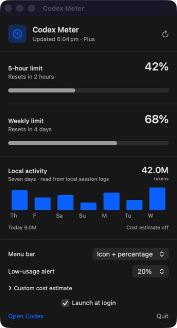

# Codex Meter

**Your Codex limits, reset times and local activity — without another dashboard, account or tracking service.**

[](https://github.com/TheJhyeFactor/codex-meter/releases/latest)
[](https://www.swift.org/)
[](LICENSE)
[](https://github.com/TheJhyeFactor/codex-meter/releases/latest)

Codex Meter is a free, open-source macOS menu bar app that shows how much Codex usage you have left, when it resets and how your local activity is trending.

I built this because I wanted one simple answer sitting in the menu bar: **how much Codex do I have left?** I did not want fake estimates, a web account, an Electron app or another service collecting usage data.



## Why Codex Meter is different

### Honest when data fails

If Codex cannot return a current limit, Codex Meter says it is unavailable. It never leaves a stale percentage looking current and never invents a reset estimate.

### Open enough to trust

The complete Swift source, local-log parser, build scripts and release automation are public. You can inspect exactly what the app reads and verify that it does not copy credentials or transmit local history.

### A true one-job Mac app

No Electron runtime, background helper daemon, analytics SDK or external database. The native app sleeps between quota checks and scans local activity at most every ten minutes.

### Power without a privacy trade-off

Alert thresholds, menu-bar modes, history charts, cost rates and CLI automation stay on your Mac. No separate API key or external dependency is required.

## Features

- Shows the most constrained Codex allowance directly in the macOS menu bar.
- Breaks down every available usage window with a percentage and local reset time.
- Refreshes automatically every two minutes, with manual refresh when you want it.
- Warns you when remaining usage drops below 10%, 20%, or 30%.
- Detects stale or unavailable data instead of leaving a misleading old number visible.
- Builds a seven-day token activity chart from aggregate events in local Codex session logs.
- Calculates an optional API-equivalent cost estimate using rates you enter yourself.
- Switches between icon + percentage, percentage-only, icon-only and activity-chart menu-bar modes.
- Includes a universal `codex-meter` CLI with stable text/JSON output and threshold exit codes.
- Supports launch at login without adding a Dock icon.
- Works natively on Apple silicon and Intel Macs.

## Download and install

1. Download the latest `Codex-Meter-*.zip` from [GitHub Releases](https://github.com/TheJhyeFactor/codex-meter/releases/latest).
2. Unzip it and move **Codex Meter.app** into `/Applications`.
3. Open it once. The gauge and remaining percentage will appear in your menu bar.

The ZIP also includes the optional `codex-meter` command-line tool and an installation note.

The current community build is ad-hoc signed, not Apple-notarized. If macOS blocks the first launch, Control-click the app in Finder, choose **Open**, then confirm **Open** once. The normal double-click flow works after that.

### Requirements

- macOS 13 Ventura or newer
- ChatGPT/Codex installed and signed in
- A Codex plan that returns rate-limit information

Codex Meter checks the ChatGPT app bundle and common Homebrew, npm, Volta, and local CLI locations. Developers launching from Terminal can also set `CODEX_PATH` to an absolute Codex executable path.

## Privacy by design

This app has one job and does not need your data for anything else.

- No analytics
- No ads
- No tracking
- No extra network service
- No copied or stored Codex credentials
- No uploaded session history

Codex Meter starts the local `codex app-server` process and calls its read-only `account/rateLimits/read` method. For history, it prefilters candidate `token_count` lines from local rollout logs, then a narrow decoder retains only timestamps and cumulative numeric totals; prompts, responses and tool payload fields are ignored. It never reads `~/.codex/auth.json` and never calls the rate-limit reset action. See [Privacy](docs/privacy.md) and [Architecture](docs/architecture.md) for the full data flow.

## CLI and scripting

```sh
# Human-readable limit status
codex-meter status

# Stable JSON for Shortcuts, jq or scripts
codex-meter status --json

# Exit 2 when the tightest window reaches 20% or lower
codex-meter status --threshold 20

# Seven days of local token activity
codex-meter history --days 7 --json
```

Cost estimates use optional user-supplied USD-per-million-token rates:

```sh
codex-meter history --days 30 \
  --input-rate 2.00 \
  --cached-input-rate 0.50 \
  --output-rate 8.00
```

The result is labelled **API-equivalent estimate**. It is not presented as ChatGPT subscription spend. See the full [CLI reference](docs/cli.md).

## Build it yourself

You need the macOS Swift toolchain.

```sh
git clone https://github.com/TheJhyeFactor/codex-meter.git
cd codex-meter
SKIP_LIVE_CODEX_CHECK=1 ./scripts/test.sh
./scripts/build-app.sh
open "dist/Codex Meter.app"
```

Run `./scripts/test.sh` without the environment variable when Codex is installed and signed in to include the live integration check.

## Why open source?

A usage meter should be easy to inspect and easy to trust. You can see exactly what Codex Meter runs, how it reads the percentage, what it stores, and what it does not touch.

If you find a bug or have a practical improvement, [open an issue](https://github.com/TheJhyeFactor/codex-meter/issues) or read [CONTRIBUTING.md](CONTRIBUTING.md).

## Widget status

The data layer is ready for a future macOS widget, but the public ad-hoc build does not claim WidgetKit support yet. Reliable widgets require an Apple team-bound App Group, separately signed extension and notarized distribution. Shipping a half-working widget would break the same honest-error promise this app is built around. The exact production path is documented in [Widget roadmap](docs/widget-roadmap.md).

## Project status

Codex Meter tracks the local Codex app-server interface and local rollout aggregate format. These can change between Codex versions, so compatibility fixes may be needed as Codex evolves. Errors are shown honestly rather than replaced with estimated quota data.

## License

MIT licensed. Free to use, modify, and share. See [LICENSE](LICENSE).

---

Built and maintained by [Jhye / The Jhye Factor](https://github.com/TheJhyeFactor).

> Codex Meter is an independent community project. It is not affiliated with, endorsed by, or sponsored by OpenAI. Codex and OpenAI are trademarks of their respective owners.
